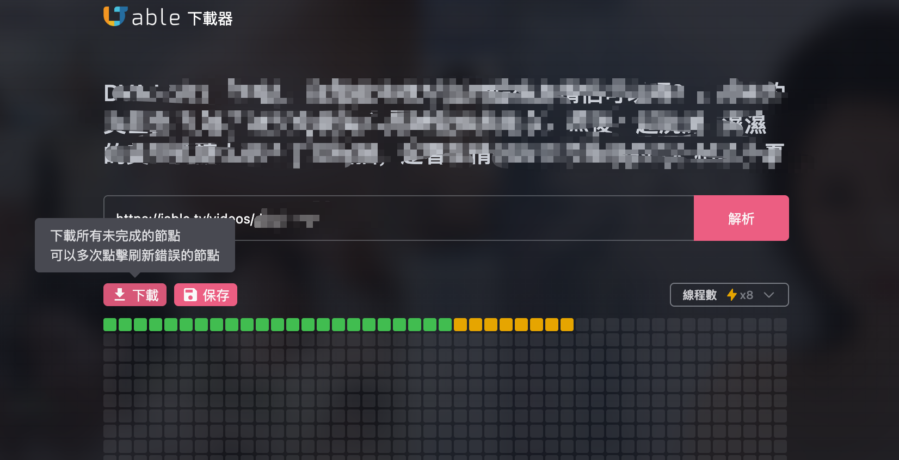

# Jable Download 插件安裝說明

## 預覽

## 功能特色
- **純 JavaScript 實現**：無需安裝其他應用程序，直接在瀏覽器中運行
- **多線程下載**：最大支持 8 線程並行下載，大幅提升下載速度
- **輕量級設計**：插件體積小巧，不占用過多系統資源

## 下載地址
https://github.com/opt654/jable-download/releases/download/v1.0.0/jable-download.zip

## 安裝步驟

### 1. 下載插件
- 點擊上方下載地址，下載 `jable-download.zip` 文件到您的電腦

### 2. 解壓文件
- 找到下載的 `jable-download.zip` 文件
- 右鍵點擊文件，選擇「解壓到當前文件夾」或「解壓到...」
- 解壓後會得到一個包含插件文件的文件夾

### 3. 開啟Chrome開發者模式
- 打開Chrome瀏覽器
- 在地址欄輸入：`chrome://extensions/`
- 或者通過菜單：右上角三點 → 更多工具 → 擴展程序

### 4. 啟用開發者模式
- 在擴展程序頁面右上角，找到「開發者模式」開關
- 點擊開啟開發者模式

### 5. 加載插件
- 點擊「載入未封裝項目」按鈕
- 選擇剛才解壓的插件文件夾
- 點擊「選擇資料夾」

### 6. 完成安裝
- 插件會自動加載並出現在擴展程序列表中
- 您可以在瀏覽器右上角看到插件圖標
- 點擊圖標即可開始使用

## 注意事項
- 請確保Chrome瀏覽器版本較新，建議使用Chrome 88以上版本
- 如果遇到權限問題，請檢查Chrome的擴展程序權限設置
- 插件僅供學習和研究使用，請遵守相關法律法規